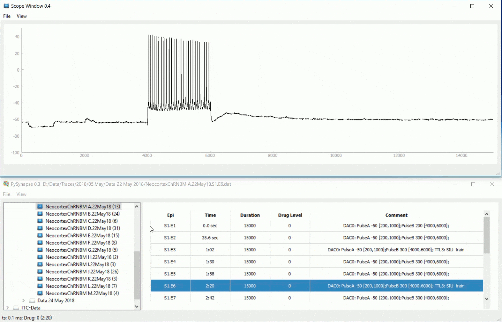

# PySynapse

An interactive utility for electrophysiological data analyses.



Dated history lives in [CHANGELOG.md](CHANGELOG.md).

## Setup

Uses conda (`environment.yml`). PyQt5 and pyqtgraph install more reliably this way than with pip/Poetry.

```bash
cd /path/to/PySynapse
conda env create -f environment.yml
conda activate pysynapse
python SynapseQt.py
```

If the env already exists:

```bash
conda activate pysynapse
python SynapseQt.py
```

Startup paths live in `settings.yaml` under `default.startpath` (`win` / `dar` / `lin`). Override locally with `settings.local.yaml` (gitignored) or `PYSYNAPSE_STARTPATH__DAR=/your/path`.

Plot and window appearance: `resources/config.ini` (`theme = whiteboard` for a light UI). File → Settings still uses that ini for export options.

## Layout

* `SynapseQt.py`: main window
* `app/`: Scope, toolbox, settings, annotations
* `util/`: `.dat` reader (`ImportData.py`), spike detection (`spk_util.py`, `MATLAB.py`), figure export
* `resources/`: icons, fonts, `config.ini`
* `scripts/`: batch helpers (not part of the GUI)
* `database/`: CSVs for File → Load Database

**Planned Mirage features:** stack as movie, maximum-intensity projection, dF/F trace.

## Load Database

**File → Load Database** opens a spreadsheet (`.csv`, `.xlsx`, `.xls`). The dialog starts in `database/`. Rows become the episode table; clicking a row still opens Scope.

Required columns (header names are case-sensitive):

| Column | Maps to | Notes |
|--------|---------|--------|
| `Cell` | Name | Cell label without episode, e.g. `Neocortex C.29Jan15` |
| `Episode` | Epi | `S1.E24` |
| `SweepWindow` | Duration | Sweep length in ms |
| `Drug` | Drug Name | Drug string; empty is fine |
| `DrugTime` | Drug Time | Seconds since drug start (numeric) |
| `WCTime` | Time | Seconds since whole-cell (numeric) |
| `StimDescription` | Comment | DAC/TTL summary |

Optional:

* `Show`: if this column exists, only rows whose value is true (`1`, `True`) are loaded.

SynapseQt uses the `path` column when present (the finder script writes full `.dat` paths). Otherwise it rebuilds `startpath` + `get_cellpath(Cell, Episode)`. `Show` is a true/false flag (`1`/`0`), not a row index.

Any other columns are ignored by the GUI (the finder keeps extra analysis fields in the same file for inspection). Set `Show` to `0` to hide a hit without deleting it.

## Finding persistent-activity cells

`scripts/find_persistent_activity.py` scans LabWorld `.dat` files and writes a Load Database CSV.

Criteria (edit the parameter block at the top of the script):

1. Filename prefix `Neocortex`
2. Drug Level 1
3. Stimulus channel has a ~2 s depolarizing step (usually DAC PulseB)
4. Prefer a preceding hyperpolarizing Rin pulse (PulseA, e.g. −50 pA)
5. At least 12 s of recording after the depolarizing step
6. Spikes persist ≥ 12 s after the step (`spk_count` / Event Detection)

```bash
conda activate pysynapse
python scripts/find_persistent_activity.py
```

Output: `database/persistent_activity.csv`. Then File → Load Database and pick that file.

## To-dos

* Integrate Ben's clipboard program to make .ini files (Export .ini file)
* Export matplotlib figure to Bokeh for more interactive display
